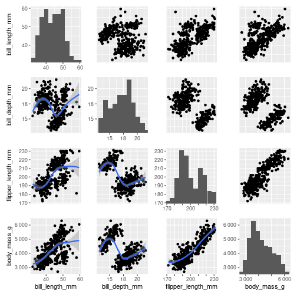

# pairplot

Library for making pairplots in R, inspired by [seaborn.pairplot](https://seaborn.pydata.org/generated/seaborn.pairplot.html) and [GGally::ggpairs()](https://ggobi.github.io/ggally/reference/ggpairs.html).
and based on `ggplot2` and `patchwork`.
This package is small but designed to be general. 

The grid region is made of three regions:
1) Lower triangle
2) Diagonal
3) Upper diagonal

Each region can be mapped to a plot function or NULL.
IF NULL, the element_blank() is assigned. 
This way you can build triangle plots.

# Installation

```r
devtools::install_github("sondalex/r-pairplot")
```

I recommend installing a specific commit from master branch in your projects. 
The API is likely to change rapidly.

# Example



# Remarks

Currently, `pairplot` has **no unit-test implemented**.
It is likely that there exist underlying bugs.
If you catch one, opening an issue and/or proposing a pull request
would be really helpful.
